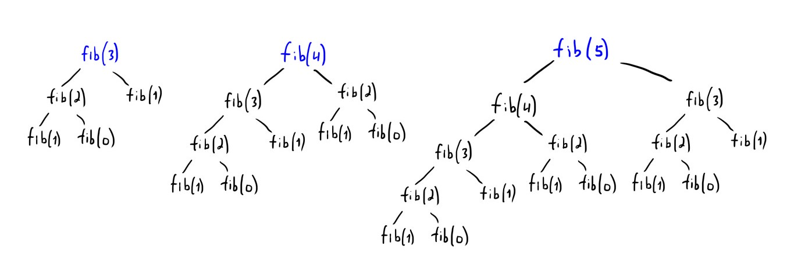

|fib|2 | 3  | 4  |  5 |6   |
| ------------ | ------------ | ------------ | ------------ | ------------ |
|Ветки|2|4   | 8  |  14 | 22  |

**Сложность по времени** $$O(2^{n-1})$$
Экспоненциальный рост числа вызовов функции и времени выполнения.

**Сложность по памяти** $$O(n)$$
По мере увеличения значения n, уровень рекурсии увеличивается, что приводит к использованию дополнительной памяти на стеке для каждого вызова функции